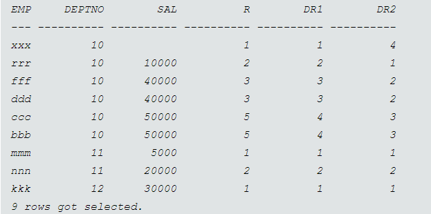

# Organizing data

#### Sorting: Ascending Order
lowest value first 
arranged in ascending order
highest value last
#### Sorting: Descending Order
Highest value first
arranged in descending order
lowest value last
#### [ORDER BY Clause](https://www.w3schools.com/sql/sql_orderby.asp
)
order by clause entered at the end of the select statement
#### [Ranking functions](https://www.sqlservertutorial.net/sql-server-window-functions/sql-server-rank-function/)

##### RANK() (placement) 
This gives you the ranking within your ordered partition. 
Ties are assigned the same rank, with the next ranking(s) skipped. 
Therefore, if you have one item at rank 1, have 3 items at rank 2, the next rank listed will be ranked 5.
    
    SELECT height, color
    RANK() OVER (PARTITION BY color ORDER BY height DESC) height_rank
    FROM stickmen
    

##### DENSE_RANK() (value) 
This gives you the ranking within your ordered partition, but the ranks are consecutive in it. 
Also, no ranks are skipped if there are ranks with multiple items.
Therefore, if you have one item at rank 1, have 3 items at rank 2, the next rank listed will be ranked 3.

    SELECT height, color
    DENSE_RANK() OVER (PARTITION BY color ORDER BY height DESC) height_rank
    FROM stickmen

     rank() over (partition by deptno order by sal nulls first) r

    , dense_rank() over (partition by deptno order by sal nulls first) dr1

    , dense_rank() over (partition by deptno order by sal nulls last) dr2

##### ROW_NUMBER() 
labels the rows in order, AS alias to 'Row Number'

[NTILE()](https://www.sqlservertutorial.net/sql-server-window-functions/sql-server-ntile-function/:~:text=Introduction%20to%20SQL%20Server%20NTILE,bucket%20number%20starting%20from%20one)

Ranks after grouping and partition, AS alias to 'Ntile'

[Top n keyword](https://www.w3schools.com/sql/sql_top.asp)  
top n shows the top number of rows meeting the criteria 
TOP, LIMIT, and ORACLE do the same thing different ways 

[Group_by](https://www.sqlservertutorial.net/sql-server-basics/sql-server-group-by)

The GROUP BY clause allows you to arrange the rows of a query in groups. The groups are determined by the columns that you specify in the GROUP BY clause.

[Having clause](https://www.sqlservertutorial.net/sql-server-basics/sql-server-having/)

The HAVING clause is often used with the GROUP BY clause to filter groups based on a specified list of conditions.

WHERE clause is used before grouping and HAVING clause is used after grouping

[ROLLUP](https://www.databasejournal.com/features/mssql/using-the-rollup-cube-and-grouping-sets-operators.html)

The ROLLUP operator is used with the GROUP BY clause.  It is used to create subtotals and grand totals for a set of columns.  The summarized amounts are created based on the columns passed to the ROLLUP operator.

