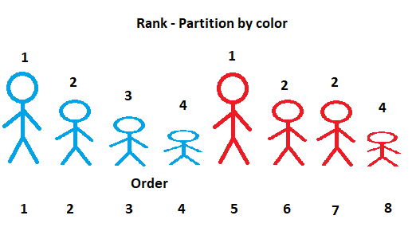

# Organizing data

####Sorting: Ascending Order
lowest value first 
arranged in ascending order
highest value last
####Sorting: Descending Order
Highest value first
arranged in descending order
lowest value last
#### [ORDER BY Clause](https://www.w3schools.com/sql/sql_orderby.asp
)
order by clause entered at the end of the select statement
####[Ranking functions](https://www.sqlservertutorial.net/sql-server-window-functions/sql-server-rank-function/)

#####RANK() (placement) 
This gives you the ranking within your ordered partition. Ties are assigned the same rank, with the next ranking(s) skipped. Therefore, if you have 3 items at rank 2, the next rank listed will be ranked 5.

#####DENSE_RANK() (value) 
This gives you the ranking within your ordered partition, but the ranks are consecutive in it. Also, no ranks are skipped if there are ranks with multiple items.

##### ROW_NUMBER() 
labels the rows in order, AS alias to 'Row Number'

[NTILE()](https://www.sqlservertutorial.net/sql-server-window-functions/sql-server-ntile-function/:~:text=Introduction%20to%20SQL%20Server%20NTILE,bucket%20number%20starting%20from%20one)

Ranks after grouping and partition, AS alias to 'Ntile'

[Top n keyword]
The SELECT TOP clause is used to specify the number of records to return.
 
Not all database systems support the SELECT [TOP](https://www.w3schools.com/sql/sql_top.asp) clause. MySQL supports the LIMIT clause to select a limited number of records, while Oracle uses ROWNUM.
TOP, LIMIT, and ROWNUM  have the same results with different syntax.
 
Because the order of rows stored in a table is unspecified, the SELECT TOP statement should be used in conjunction with the ORDER BY clause. The result set will be limited to the first N number of ordered rows.

Lets do some [examples](https://www.mysqltutorial.org/tryit/query/mysql-limit/#3)  

[Group_by](https://www.sqlservertutorial.net/sql-server-basics/sql-server-group-by)

The GROUP BY clause allows you to arrange the rows of a query into groups. The groups are determined by the columns that are specify in the GROUP BY clause.   

Multiple columns can be listed in the GROUPBY clause.  A group is produced for each combination of columns listed in the GROUP BY clause.

*SELECT customer_id, YEAR (order_date) order_year
FROM sales.orders
WHERE customer_id IN (1, 2)
GROUP BY customer_id, YEAR (order_date) 
ORDER BY customer_id;*    
                  

The GROUP BY statement is often used with aggregate functions (COUNT, MAX, MIN, SUM, AVG) to generate summary reports. 
The GROUP BY clause arranges rows into groups and an aggregate function returns the summary for each [group.](http://dba.fyicenter.com/faq/mysql/Use-Multiple-Columns-in-GROUP-BY.html)

[Having clause](https://www.sqlservertutorial.net/sql-server-basics/sql-server-having/)

The HAVING clause is often used with the GROUP BY clause to filter groups based on a specified list of conditions.

WHERE clause is used before grouping and HAVING clause is used after grouping

[ROLLUP](https://www.databasejournal.com/features/mssql/using-the-rollup-cube-and-grouping-sets-operators.html)

The ROLLUP operator is used with the GROUP BY clause.  It is used to create subtotals and grand totals for a set of columns.  The summarized amounts are created based on the columns passed to the ROLLUP operator.

